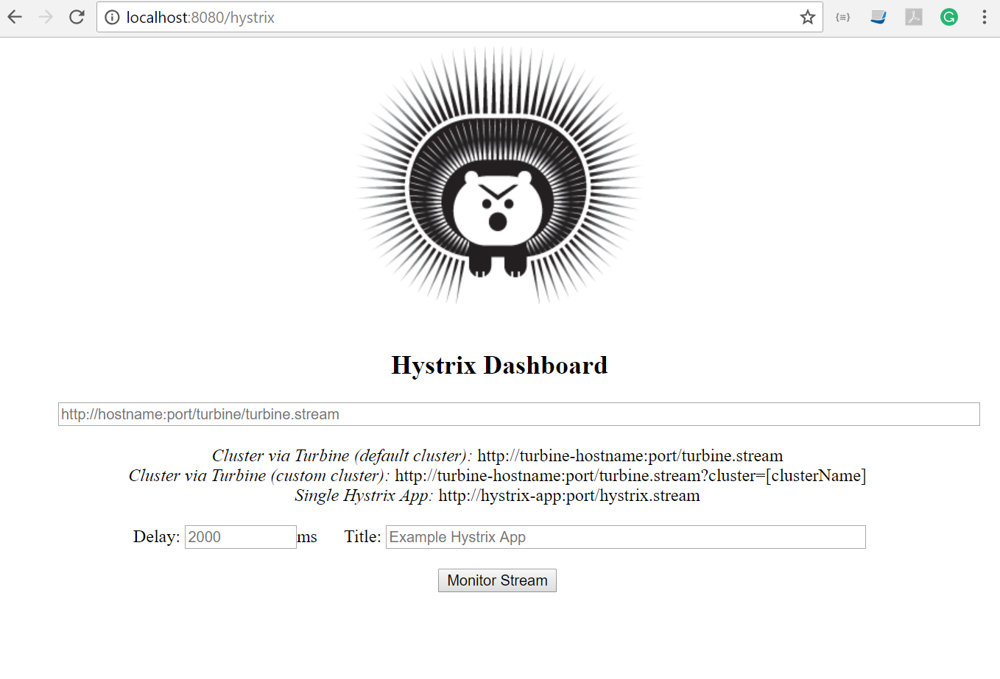
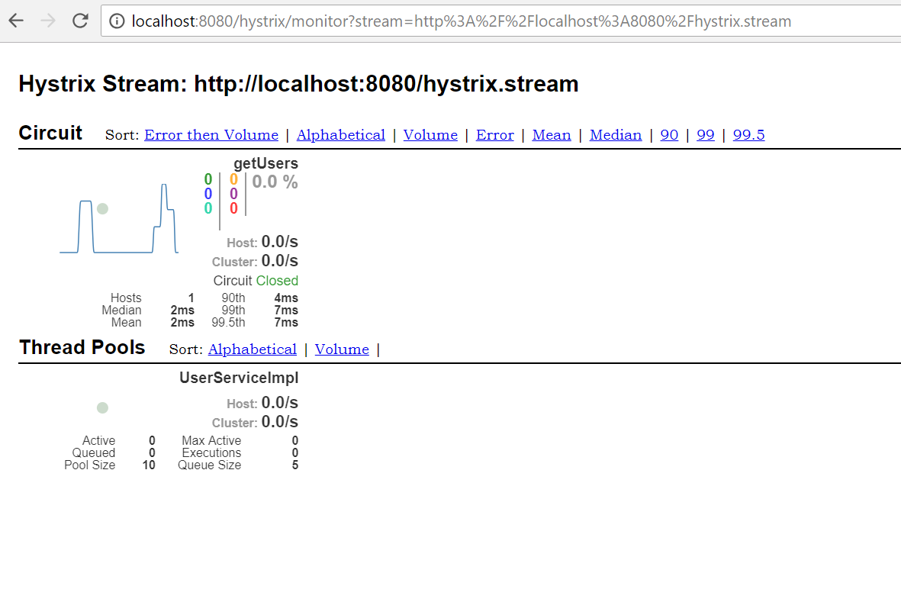
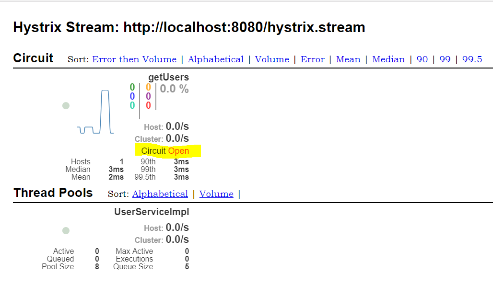

# Spring Boot with Hystrix setup

## Introduction

This project provide an quick example how to setup Hystrix and its dashboard with Spring Boot.

## Requirements

This module requires the following modules/libraries:

* [Maven](https://maven.apache.org/download.cgi)
* [JDK/JRE](http://www.oracle.com/technetwork/java/javase/downloads/index.html)

## Build Project
Use your favorite IDEA or use maven command in command line interface
* mvn clean install
* java -jar \target\hystrix-with-springboot-0.0.1-SNAPSHOT.jar(run the command from project root directory)

## Rest Endpoints

Once the project is build and running on your localhost machine, you can access the list of user using [/users/list](http://localhost:8080/users/list) end point.

### Hystrix Stream
To access the hystrix stream you can go to the [/hystrix.stream](http://localhost:8080/hystrix.stream) which gives you the hystrix metrics stream.

**Note**
Hystrix stream is only showed when there is an actual call to rest endpoint which are annotated with @HystrixCommand.

### Hystrix Dashboard

Hystrix dashboard can be access on [/hystrix](http://localhost:8080/hystrix) endpoint.

 

To monitor the circuit break, there is a need to provide the hystrix.stream url to the hystrix dashboard, 
which will show you the circuit breaker monitoring as shown in image.

**Note** In case of request failure the Circuit status is *Open* and in case of success request the circuit status is *closed*.
 

## Reference

* [Circuit Breaker](https://spring.io/guides/gs/circuit-breaker/)
* [Hystrix Command Properties](https://github.com/Netflix/Hystrix/wiki/Configuration)